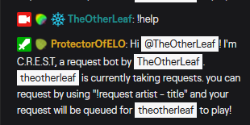

# Chat Commands

## Global commands

- **!request** - *Can be changed in settings (some people prefer !suggest)* - Adds a request to the queue. Only one request per user is supported at this time, so requesting again will change their request until their request is played.
  - *Example: !request Polyphia - GOAT*

- **!remove** - Removes own request from queue.

- **!help** - Responds with a phrase helping viewers on how to request a song.
  - *Note: the command output will vary depending on requests being enabled or not, randomized or not.*

- **!crest** - Responds with the link to the CREST website so that people can check out the features, guides or even download it for themselves.

- **!list** - *Experimental* - Uploads request list to web server (throttled to only be uploaded if used more than 10 minutes after the previous !list usage)

## Moderator-only commands

- **!remove [username]** - Used by **moderators** to remove a certain users request.
  - *Example: !remove ThatOneGuyWhoWontGiveUpOnTTFAFRequests*

- **!ignore** - Used to ignore a certain user, requests from this user will not be added to the queue.
  - *Example: !ignore ThatOneGuyWhoWontGiveUpOnTTFAFRequests*

- **!delignore** - Used to remove an ignore on a certain user.
  - *Example: !delignore ThatOneGuyWhoWontGiveUpOnTTFAFRequestsButWantsToRequestJordan3000PercentInstead*

- **!playnext** - Used to trigger the next request to be played.
  - *Note: does the same thing as pressing on the play button on the app, so randomizer settings are taken into account.*

- **!pause / !unpause** - Used to pause/unpause requests, useful for when stream is winding down.
