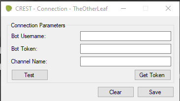
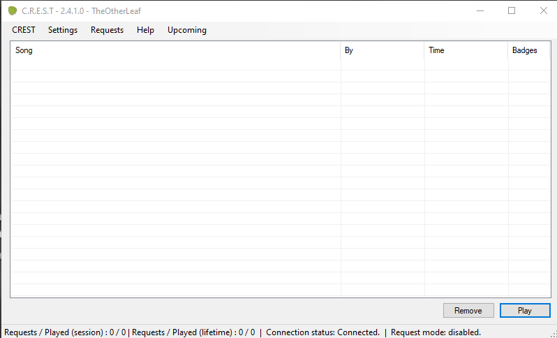

# Getting Started (by [SDG_Shawn](https://twitch.tv/sdg_shawn))

- Download the program from the [home page.](https://crest.whaskell.pw/)

- Run the setup program that you have downloaded. (IT IS VIRUS FREE so you can approve it through the antivirus/firewall protection you have). It will open up a window that looks like below.

  - **Bot Username** - This is the name of the account you want the bot to run through. This **HAS** to be a Twitch account that you own. It can be your live channel if you do not have an alternative account for the bot.

  - **Bot Token** - This is the authentication code that you need to link the account to the box. In order to get this, click the **GET TOKEN** button, which will take you to the official Twitch OAuth password generator, connect your bot account and paste the resulting password in this box.

  - **Channel Name** - This is the name of the channel that you stream from. For example, if *TheOtherLeaf* was streaming and was setting up this bot, the channel name will simply read *TheOtherLeaf*.

- If the above has been done correctly then this window will open:

Note that the bottom bar will say **Connection Status: Connected**. If you have linked your account correctly.

- In order to turn on Requests, as they default as off, click **Requests** on the top bar and click the first option named **Enabled**.
- Congratulations, your **CREST** bot is now set up and can take requests whilst you focus on hitting those notes!
