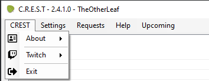
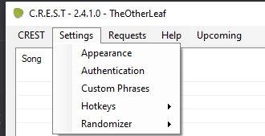
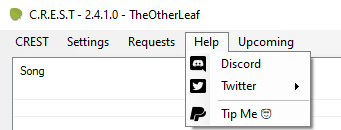
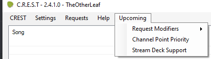

# Menus and Features guide (by [SDG_Shawn](https://twitch.tv/sdg_shawn))

## The CREST section

- The **About** option is where you will find the info about the current version of your CREST bot and the full changelog, in case you wish to read what changes have happened since the inception of the bot.

- The **Twitch** option is where you will disconnect and reconnect your Twitch account should you need to change accounts it is linked to or reconnect if there was any issues with the connection between Twitch and the Bot.

- The **Exit** option closes the program. That's it :)

## The Settings section

- The **Appearance** option is where you can change the Font size of your request list.

- The **Authentication** option will take you back to the screen seen in the set up guide, where you can re-authenticate the account that you have linked to the bot.

- The **Custom Phrases** option is where you can change the wording of what the bot will say in your chat.
*Note: If the account the bot goes through in your chat is subbed to you, it CAN use your emotes, as well as Twitch Global or any other subscribed channel emotes.*

- The **Hotkeys** option allows you to bind keys in order to play and remove songs from your list instead of clicking play.
*Note: this needs to be enabled before it can work.*

- The **Randomizer** option will make it so that all requests in your list will be randomly selected. The settings will allow you to edit bias based on whether or not the requester is a Moderator, a VIP or a Subscriber.

## The Requests section

- The **Enabled** option is where you can turn Requests on/off. The bottom bar of the bot will either say Request Mode: Enabled or Request Mode: Disabled based on this option

- The **Clear All** option allows you to remove all requests from the current queue.

- The **Purge Inactive** option will remove any requests that are made by users who are not active in the chat (they may have left the stream).
*Note: the first time you click, CREST will highlight inactive users in red, you can then purge again to remove red requests or whitelist them using the button bottom left, this is due to it being an experimental feature and not wanting to accidentally remove requests from active users.*

- The **Ignores** option is the option where you can tell CREST to ignore requests from certain users or certain song requests.

## The Help section

- The **Discord** option is a direct link to the *Leaf’s Tree* Discord where you can get in contact directly with the Developer if you are unsure what to do or how to fix a problem you may be having.

- The **Twitter** option is where you can view the developers Twitter and Tweet a question that you have with the program.

- The **Tip Me** option is self explanatory, will direct you to the paypal tip page, please let us know your username on Twitch as you'll receive a donator badge and future perks.

## The Upcoming section

- This is just a handy section so that you can see what is going to be added to CREST as development continues.
